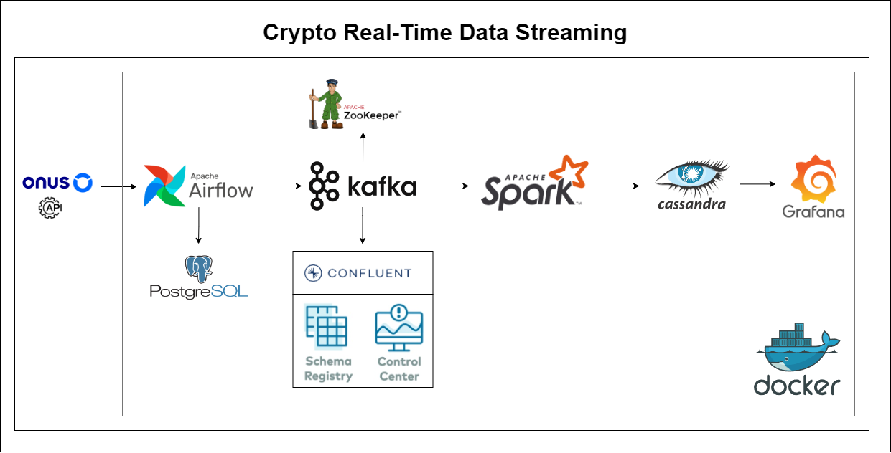
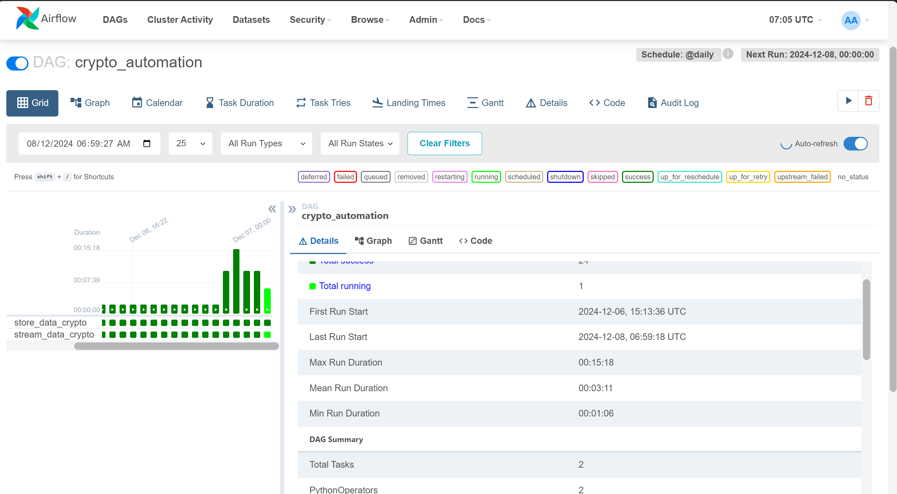
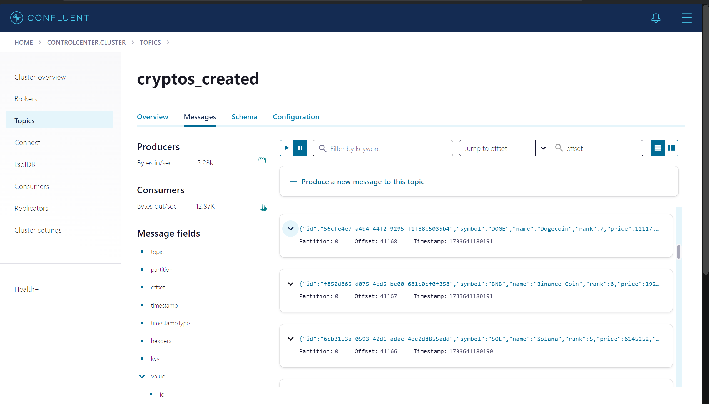
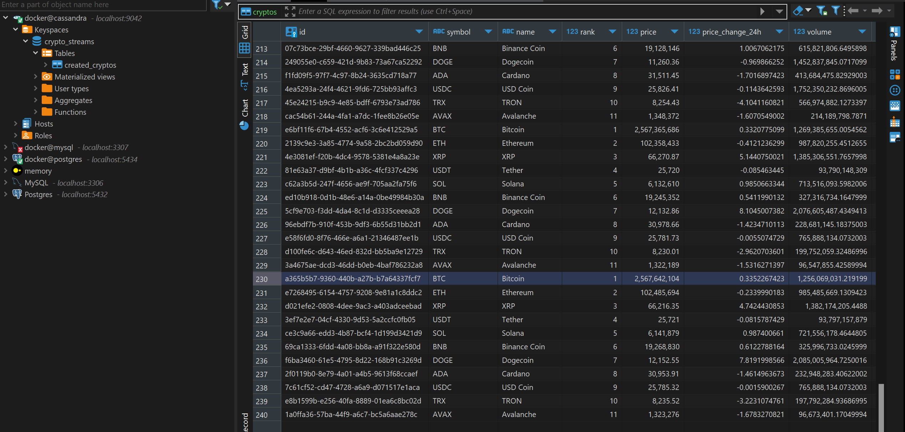
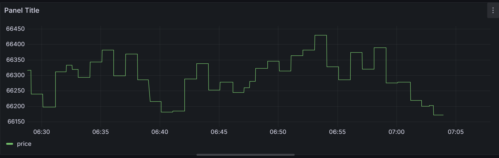

# Transforming Crypto Insights: Real-Time Data Streaming with Kafka, Spark, PostgreSQL, Docker, Cassandra, and Grafana

In the fast-paced world of cryptocurrency, real-time data streaming is essential for tracking market trends, predicting price fluctuations, and making timely decisions. This project harnesses the power of cutting-edge technologies like <b>Kafka</b>, <b>Spark</b>, <b>PostgreSQL</b>, <b>Docker</b>, <b>Cassandra</b> and <b>Grafana</b> to build an efficient, scalable system for streaming and analyzing crypto data in real time.

<p align="center">
  
</p>

## Main Tasks

This project establishes a robust, real-time crypto data analysis platform, tackling the above challenges by leveraging modern data engineering tools and methodologies.

- Real-Time Data Capture: Ingest crypto data streams from exchanges and APIs in real time using Kafka, ensuring minimal latency.
- Scalable and Distributed Architecture: Utilize Spark and Cassandra to handle high data throughput and processing efficiently, ensuring scalability for growing crypto datasets.
- Data Quality and Validation: Employ schema management and real-time validation to maintain data accuracy and consistency.
- ETL Automation: Automate the data transformation process, from raw ingestion to structured analytics-ready storage in PostgreSQL, minimizing manual intervention.
- Comprehensive Monitoring and Visualization: Integrate Grafana for real-time dashboards, monitoring the health and performance of data streams while providing actionable market insights.

This project transforms raw crypto data into real-time actionable insights, enabling stakeholders to respond swiftly to market trends. With a scalable and efficient system, it minimizes data latency, enhances data quality, and empowers businesses to stay ahead in the competitive crypto landscape.

## Repository Structure
```shell
crypto-project/
├── .idea/                   # IDE-specific settings and configurations
├── crypto_stream.py         # Main script for crypto streaming
├── dags/                    # Airflow DAGs
│   ├── get_data.py          # Script for fetching data
│   └── kafka_stream.py      # Script for handling Kafka streaming
├── docker-compose.yml       # Docker Compose configuration file
├── picture/                 # Directory for storing images
├── README.md                # Project documentation file
├── requirements.txt         # Python dependencies
├── script/                  # Shell scripts
│   └── entrypoint.sh        # Entrypoint script for Docker
└── venv/                    # Python virtual environment
    ├── Lib/                 # Libraries and packages
    └── Scripts/             # Executables for the virtual environment
```
###  Project file:

- `kafka_stream.py`: [kafka_stream.py](dags/kafka_stream.py) is created to fetches user data from ONUS API, processes and streams into a Kafka topic named `crypto_created`. The DAG in <b>Apache Airflow</b> employs PythonOperator to handle the task execution.

- `crypto_streaming.py`: [crypto-streaming.py](crypto-streaming.py) is builded to create `cassandra_keyspace`, `cassandra_table`, `cassandra_connection`, `spark_connection`, `connect_to_kafka` and integration between them.

## Getting Started

1- Clone the repository:

```
git clone https://github.com/nits302/Crypto-Real-Time-Data-Streaming.git
```

2- Navigate to the project directory

```
cd streaming_realtime_data
```

3- Set Up a Virtual Environment in Python

```
pip3 install virtualenv
python -m venv venv
source venv/bin/activate
```

4- Install the needed packages and libraries:

```
pip3 install -r ./requirements.txt
```

5- Install Docker, Docker compose:

```
sudo ./installdocker.sh
docker --version
docker compose version
```

6- Build docker:

```
docker compose up -d
```

Check containers in docker desktop:

<p align="center">
  
</p>

7- Run step by step files:

```
python crypto-streaming.py
```

8- Access to airflow UI to monitor streaming process: `localhost:8080` with account: `admin`, password: `admin`

<p align="center">
  
</p>

9- Access to `control center UI` monitor Topic health, Procuder and consumer performance, Offset, Cluster health: `localhost:9021`

<p align="center">
  
</p>

10- Check data in `Cassandra` with command:


<p align="center">
  
</p>

11- Visualize in `Grafana`:

<p align="center">
  
</p>


## 🚀 Video DEMO

[Demo Project Crypto Real-Time Data Streaming](https://www.youtube.com/watch?v=__8EhETsx5Y)

### Reference:

[1]. [Realtime Data Streaming](https://www.youtube.com/watch?v=GqAcTrqKcrY)

[2]. [Cassandra and pyspark](https://medium.com/@yoke_techworks/cassandra-and-pyspark-5d7830512f19)

<b> ⚡️That's all for my project, thanks for watching. If you have any question, don't hesitate inbox me.⚡️</b>
